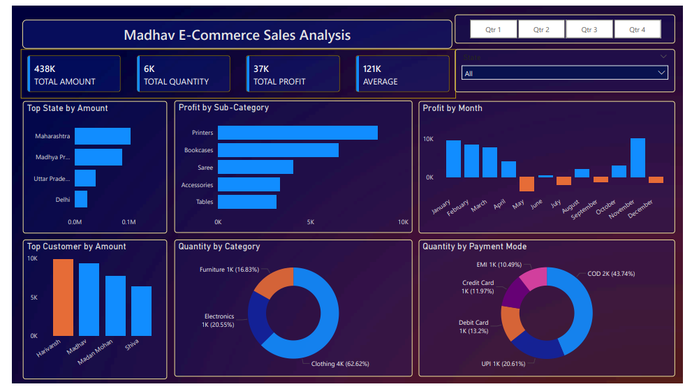

# 📊 Madhav E-Commerce Sales Analysis (Power BI)

## 📌 Project Overview
This project analyzes e-commerce sales data using Power BI to uncover insights related to sales performance, profit trends, customer behavior, and payment patterns. The dashboard helps in understanding business performance and supports data-driven decision-making.

---

## 🛠️ Tools & Technologies Used
- Power BI (Data Visualization & Dashboarding)
- Microsoft Excel (Data Source)

---

## 📂 Dataset

Contains transactional data including product category, sales amount, quantity, profit, customer details, and payment mode.

---

## 📥 Data Preparation
- Cleaned and transformed raw data using Power BI
- Handled missing and inconsistent values
- Created calculated measures for KPIs (Total Amount, Profit, Quantity)

---

## 📊 Dashboard Features

### 🔹 Key Performance Indicators (KPIs)
- Total Amount: 438K  
- Total Quantity: 6K  
- Total Profit: 37K  
- Average Sales: 121K  

### 🔹 Visualizations
- Profit by Month (trend analysis)
- Profit by Sub-Category
- Quantity by Category (distribution)
- Quantity by Payment Mode
- Top States by Sales
- Top Customers by Revenue

### 🔹 Filters / Slicers
- Quarter-wise filtering (Q1, Q2, Q3, Q4)
- State-wise filtering

---

## 🧠 Key Insights
- Maharashtra contributes the highest revenue among all states  
- Clothing category dominates with ~62% of total quantity  
- COD (Cash on Delivery) is the most used payment method (~44%)  
- Some months show negative profit, indicating potential loss periods  
- Certain sub-categories like Printers generate higher profit  

---

## 🖼️ Dashboard Preview

---

## ▶️ How to Use
1. Download the `PowerBI-Dashboard` file from the dashboard folder  
2. Open in Power BI Desktop  
3. Use filters and slicers to explore different insights  

---

## 📁 Project Structure
